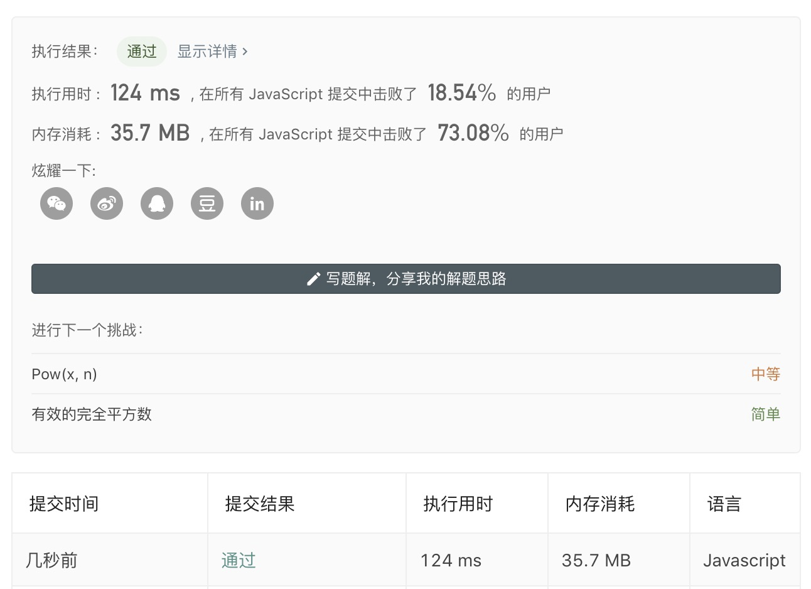

# x的平方根

## 题目

实现 int sqrt(int x) 函数。

计算并返回 x 的平方根，其中 x 是非负整数。

由于返回类型是整数，结果只保留整数的部分，小数部分将被舍去。

示例 1:

> 输入： 4  
> 输出： 2

示例 2：

> 输入: 8
> 输出: 2
> 说明: 8 的平方根是 2.82842...
> 由于返回类型是整数，小数部分将被舍去。

原题链接:  [x 的平方根](https://leetcode-cn.com/problems/sqrtx/)

## 题目解析

- 可以直接使用js原生类库的方法Math.sqrt方法，速度也比较快，但是没有任何意义
- 目标值是非负整数，代表不需要考虑负数的情况
- 返回整数部分，小数部分舍去

## 解题思路

使用暴力法遍历，如果x + 1 * x + 1 <= target ，就让x++然后终止循环

## 解题方案

```Javascript
var mySqrt = function(x) {
    var re = 0;
    while ((re + 1) * (re + 1) <= x) {
        re++;
    }
    return re;
};
```

## 解决成果


