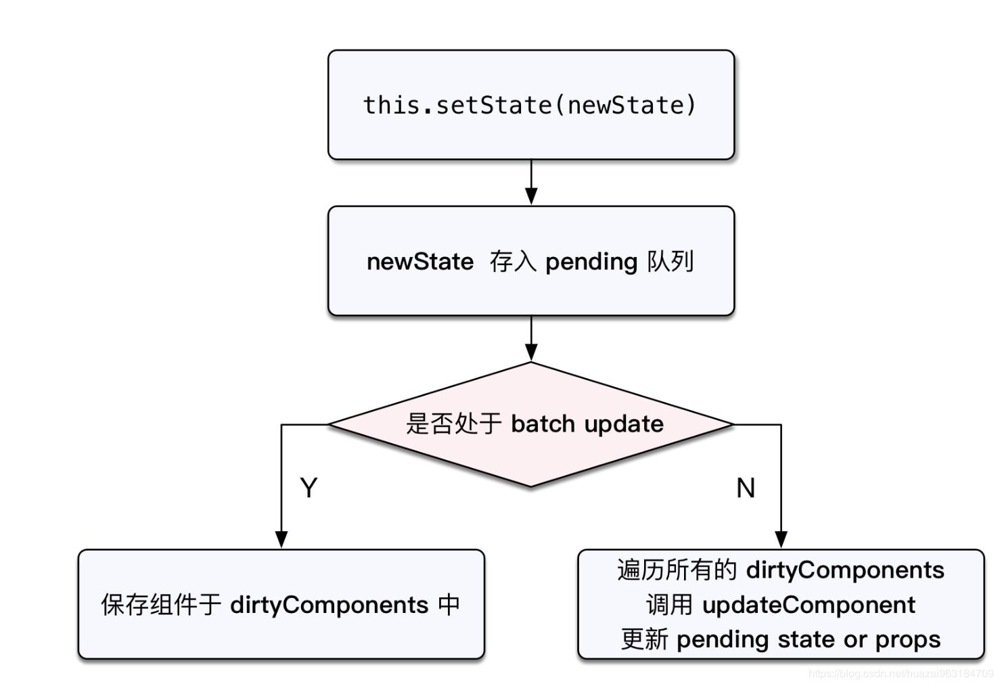
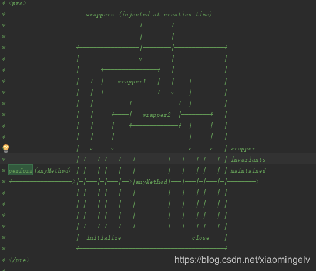

# react原理

## react原理总结

### 函数式编程

一种编程概念，类似于面向对象这种概念

state使用不可变值

```javascript
// setState的不可变值
import React from 'react'

class App extends React.PureComponent {
  state = {
    list: [0]
  }
  // 添加时不会触发更新，因为state中list的引用地址没变
  //正确的使用方式是，永远不去直接修改state的值，使用一个新的数组
  handleClick = () => {
      //错误的形式，违反了state不可变值的原则
    this.state.list.push(this.state.list.length)
    this.setState({
      //错误的形式，违反了state不可变值的原则
      list: this.state.list
      //正确的形式
      //list: [...this.state.list, this.state.list.length]
    })
  }
  render() {
    return (
        <div>
          <button onClick={this.handleClick}>添加</button>
          {
            this.state.list.map((item) => {
              return <div key={item}>{item}</div>
            })
          }
        </div>
    )
  }
}

// redux的不可变值
const initState = {count: 0}
//每次更新返回一个新的state，而不是去修改state的值
export default function( state = initState, action) {
    switch(action.type) {
        case 'setCount':
            state = { ...state, count: action.count }
            break
        default:
            break
    }
    return state
}
```

### 合成事件

所有的事件都挂载在document上，event不是原生的，是SyntheticEvent合成事件对象，模拟了所有的DOM事件的属性和方法，原生的事件放在event.nativeEvent上

为什么使用合成事件？

- 更好的兼容性和跨平台
- 挂载在document上，避免内存消耗，避免频繁解绑
- 方便事件的统一管理(如事务机制)

### setState和batchUpdate机制

setState主流程



setState是同步还是异步？
setState无所谓同步还是异步，看能是否命中batchUpdate机制。如果isBatchUpdate为true，将new State放入到dirtyComponent中。如果为false，遍历dirtyComponent，调用updateCompoent，并且更新state和props。

那些可以命中batchUpdate机制

- 生命周期和生命周期调用的函数
- React中注册的事件
- React可以管理的入口

哪些不能命中的？
setTimeout、setInterval等
自定义DOM事件
ajax请求返回
promise

### react事务机制transation

transation机制



总结来说就是在处理可管理的函数之前，设置isBatchUpdate设置为true，然后执行函数，执行完之后设置isBatchUpdate为false，然后触发遍历更新setState中传入的结果。

### 组件渲染和更新过程

组件渲染

JSX的本质即使createElement。

调用render()生成vnode

使用patch(elem, vnode)生成真实dom元素

更新过程

setState(newState) --> dirtyComponent
render()生成newVnode
使用patch(elem, vnode)生成真实dom元素

使用patch的两个阶段
reconcilliation阶段执行diff算法，纯js计算
commit阶段，将diff结果生成dom元素

### React的fiber架构和任务调度机制

为什么使用fiber架构？

js是单线程，并且和dom渲染共用一个线程，当组件足够复杂，组件更新计算和渲染压力都很大，如果这个时候有DOM操作的需求，比如动画、鼠标拖拽等，将会出现卡顿情况。

将reconcilliation阶段进行拆分(commit阶段无法拆分)，DOM需要渲染时暂停(commit阶段阶段暂停)，空闲时恢复。

使用window.requestIdleCallback监听js线程是否空闲，使用window.requestAnimation实现时间分片