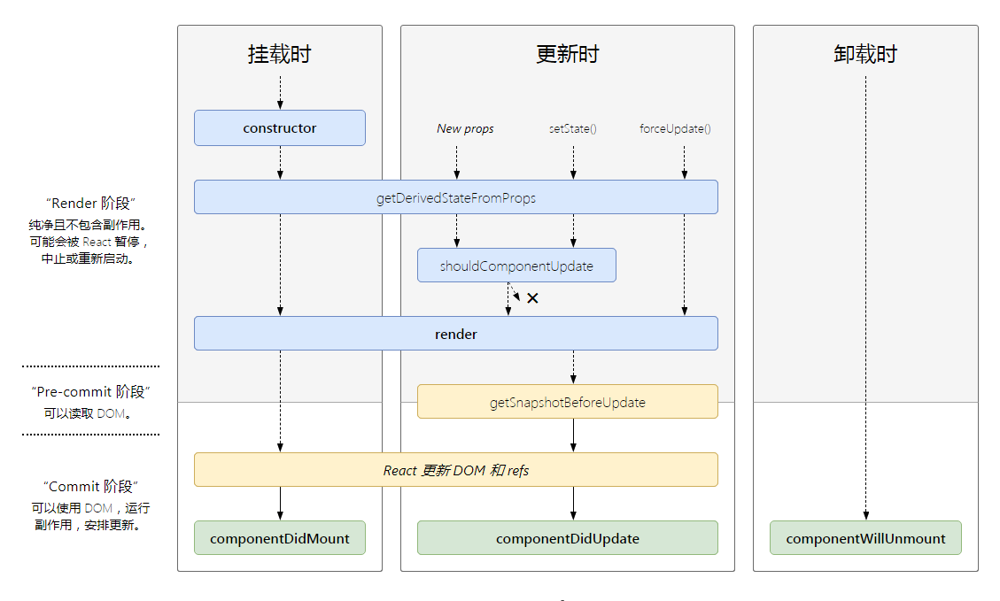

# react基础

## react基础知识

### JSX的基本使用

- 基本变量
- 插值表达式
- css class 使用
- css style 使用
- 动态属性
- 渲染插入的html
- 组件的使用，首字母必须大写
- 条件渲染
- 列表渲染

```javascript
render() {
    return (
        <div>
            <p>{this.state.msg}</p>
            <p>{this.state.flag ? 'yes' : 'no'}</p>
            <p className="title">class使用</p>
            <p style={{ fontSize: '16px' }}>style使用</p>
            <p value={this.state.value}>动态属性</p>
            <p dangerouslySetInnerHTML={{__html: '<div>需要渲染的html</div>'}}>插入原生html</p>
            <List></List>
            {
                this.state.flag ? <div>true</div> : <div>false</div>
                // 或者
                this.state.flag && <div>true</div>
            }
            <ul>
                {
                    this.state.data.map((item) => {
                        return <li key={item.id}>{item.value}</li>
                    })
                }
            </ul>
        <div>
    )
}
```

### react中的事件

#### 为什么使用事件需要bind(this)

如果不绑定this，打印this的值为undefined，因为react是合成事件，所有的事件都是在document触发的，所以this指向window，而在class中，默认是严格模式，指向window的this，会变成undefined

```javascript
render() {
    return (
        <button onClick={this.handleClick}>按钮</button>
    )
}
handleClick() {
    console.log(this)  // undefined
}
```

正确写法

```javascript
constructor() {
    this.handleClick.bind(this);
}
render() {
    return (
        <button onClick={this.handleClick}>按钮</button>
    )
}
handleClick() {
    console.log(this);  // 组件实例
    this.setState({
        count: this.state.count + 1
    });
}
//或者使用箭头函数，需要配置可以使用公共方法和公共属性的@babel/plugin-proposal-class-properties https://babeljs.io/docs/en/babel-plugin-proposal-class-properties#references
handleClick = () => {
    console.log(this);  // 组件实例
    this.setState({
        count: this.state.count + 1
    });
}
```

#### event合成事件

合成事件介绍

- 使用event.preventDefault()可以阻止默认行为(比如a标签跳转，表单提交等)
- 使用event.stopPropagation()阻止事件冒泡，防止触发的事件会被父元素监听到
- 使用event.target获取合成事件的触发事件的元素，指向当前绑定事件的元素
- 使用event.currentTarget获取合成事件的最初触发事件的元素，指向当前绑定事件的元素。这是假象，因为event不是原生的MouseEvent对象，而是合成事件的SyntheticEvent对象。
- 使用event.nativeEvent获取原生的event对象
- 使用event.nativeEvent.target获取原生的event对象触发事件的元素，指向当前点击的元素
- 使用event.nativeEvent.currentTarget获取原生的event对象触发事件的元素，指向`document`

SyntheticEvent合成事件对象，为什么使用合成事件

- 模拟了所有的DOM事件和能力，除了window.onscroll和window.resize等不挂载在DOM上面的事件
- event.nativeEvent获取原生的事件对象
- 所有的事件最终都会被挂载到document上
- 和普通的DOM事件，还有Vue事件不一样，Vue事件是挂载在原本的DOM上

```javascript
render() {
    return (
        <button onClick={this.handleClick}>按钮</button>
    )
}
handleClick = (event) => {
    event.preventDefault()      //阻止默认行为
    event.stopPropagation()     //阻止冒泡
    console.log(event.target)   //获取触发事件的元素，指向当前绑定事件的元素
    console.log(event.currentTarget) //获取最初触发事件的元素，指向当前绑定事件的元素。这是假象，因为event不是原生的event对象，而是合成事件的SyntheticEvent对象，原生的是MouseEvent对象
    console.log(event.__propo__.constructor)  //合成事件的包装类
    console.log(event.nativeEvent)  //获取原生的event对象
    console.log(event.nativeEvent.target)  //获取原生的event对象触发事件的元素，指向当前点击的元素
    console.log(event.nativeEvent.currentTarget)  //获取原生的event对象触发事件的元素，指向`document`
}
```

#### 传递参数

传递自定义参数

使用bind(this)传递自定义参数

```javascript
render() {
    return (
        <button onClick={this.handleClick.bind(this, id, value)}>按钮</button>
    )
}

handleClick(id, value, event) {
    console.log('id', id)
    console.log('id', value)
}
```

使用闭包加公共属性传递自定义参数

```javascript
handleClick = (countStep) => (event) => {
  console.log(event.nativeEvent.currentTarget)
  this.setState({
    count: this.state.count + countStep,
  })
}

render() {
  return (
    <div>
      <button onClick={this.handleClick(-1)}>-</button>
      {
        this.state.count
      }
      <button onClick={this.handleClick(1)}>+</button>
    </div>
  )
```

### 表单和受控组件

受控组件(与之对应的是非受控组件)

```javascript
handleChange = (event) => {
    this.setState({
        value: event.target.value
    })
}

render() {
    return (
        <div>
            <p>{this.state.value}</p>
            {/* 使用htmlFor代替for，因为for在js中是关键字，就像使用className代替class一样 */}
            <label htmlFor='input'>值: </label>
            <input id='input' value={this.state.value} onChange={this.handleChange} />
        </div>
    )
}
```

### 组件使用

#### props父子组件传递数据

```javascript
class Father extends React.Component {
  render() {
    return <Children msg='hello world' />
  }
}

class Children extends React.Component {
    render() {
        return <div>{this.props.msg}</div>
    }
}
```

#### props类型检查

需要使用官方的prop-types包，然后往组件上面添加propTypes静态属性

```javascript
import propscheck from 'prop-types'

class Children extends React.Component {
    render() {
        return <div>{this.props.msg}</div>
    }
}

// 校验必须传msg，并且必须是string类型
Children.propTypes = {
    msg: propscheck.string.isRequired,
}
```

或者使用static静态属性，需要安装[@babel/plugin-proposal-class-properties](https://babeljs.io/docs/en/babel-plugin-proposal-class-properties)

```javascript
import propscheck from 'prop-types'

class Children extends React.Component {
    static propTypes = {
        msg: propscheck.string.isRequired,
    }
    render() {
        return <div>{this.props.msg}</div>
    }
}
```

如果不传就会抛出Warning

```javascript
class Father extends React.Component {
  render() {
    return <Children />
  }
}
```

>index.js:1 Warning: Failed prop type: The prop `msg` is marked as required in `Children`, but its value is `undefined`.in Children (at App.js:6)

或者传错类型

```javascript
class Father extends React.Component {
  render() {
    return <Children msg={1} />
  }
}
```

> Warning: Failed prop type: Invalid prop `msg` of type `number` supplied to `Children`, expected `string`.in Children (at App.js:6)

#### 父子组件传递方法

父组件将值和修改值的方法传递给子组件

```javascript
class Father extends React.Component {
  state = {
    msg: ''
  }

  changeMsg = (event) => {
    this.setState({
      msg: event.target.value
    })
  }

  render() {
    return <Children msg={this.state.msg} changeMsg={this.changeMsg} />
  }
}
```

子组件调用父组件方法只需要`this.props.method()`调用

```javascript
import propscheck from 'prop-types'

class Children extends React.Component {
    static propTypes = {
        msg: propscheck.string.isRequired,
        changeMsg: propscheck.func.isRequired,
    }

    render() {
        const { msg, changeMsg } = this.props;
        return (
            <div>
                <p>{msg}</p>
                <input value={msg} onChange={changeMsg} />
            </div>
        )
    }
}
```

### setState的使用

#### 不能直接修改state的值，必须使用setState

直接修改`state`的值，并不会重新触发`render`函数，必须使用`setState`或者使用`this.forceUpdate();`

```javascript
class App extends React.Component {
  state = {
    count: 0,
  }

  handleClick = () => {
    this.state.count = this.state.count + 1;    //不会重新触发render
    // 使用setState会触发render
    // this.setState({ count: this.state.count + 1 });
    // 或者使用this.forceUpdate()强制触发更新，forceUpdate会导致组件跳过shouldComponentUpdate()，直接调用render()，除非是特殊情况，否则不推荐使用(vue中也有类似强制更新的方法this.$forceUpdate())
    // this.forceUpdate();
  }

  render() {
    return (
      <div>
        <p>{this.state.count}</p>
        <button onClick={this.handleClick}>添加</button>
      </div>
    )
  }
}
```

#### setState是同步还是异步，多个setState会被合并吗

##### 在同步代码和事件触发函数中都是异步的

```javascript
handleClick = () => {
    console.log('count', this.state.count)  // 0
    this.setState({
        count: this.state.count + 1
    }, () => {
        //类似于vue的nextTick
        console.log('count', this.state.count)  // 1
    })
    console.log('count', this.state.count)  // 0
}
```

##### 在setTimeout、setInterval中是同步的

```javascript
componentDidMount() {
    setTimeout(() => {
        console.log('count', this.state.count)  // 0
        this.setState({
            count: this.state.count + 1
        })
        console.log('count', this.state.count)  // 1
        this.setState({
            count: this.state.count + 1
        })
        console.log('count', this.state.count)  // 2
    })
}

render() {
    console.count('render') // 触发了3次，除了首次render之外，调用了两次setState触发了两次render
    return (
      <div>
        <p>{this.state.count}</p>
      </div>
    )
  }
```

##### 在自定义的dom事件中，setState是同步的

```javascript
class App extends React.Component {
  state = {
    count: 0,
  }
  
  componentDidMount() {
    document.querySelector('#button').addEventListener('click', this.handleClick, false);
  }

  handleClick = () => {
    console.log('count', this.state.count) // 0
    this.setState({
      count: this.state.count + 1
    })
    console.log('count', this.state.count) // 1
  }

  beforeDestroy() {
    document.querySelector('#button').removeEventListener('click', this.handleClick, false)
  }

  render() {
    return (
      <div>
        <p>{this.state.count}</p>
        <button id='button'>添加</button>
      </div>
    )
  }
}
```

#### 在ajax请求的网络回调中，setState是同步的

```javascript
componentDidMount() {
    fetch(url).then(res => res.json()).then(() => {
        console.log('count', this.state.count) // 0
        this.setState({
        count: this.state.count + 1
        })
        console.log('count', this.state.count) // 1
    })
}
```

##### 总结

- setState使用异步的好处是，可以合并多次setState的值，保证多次触发setState只会触发一次render更新。
- setState在React运行环境中都是异步的，比如生命周期钩子、合成事件的回调函数，因为这些回调函数都是React系统负责触发调用的。
- 在React监测不到的异步环境中是同步的，比如setTimeout的回调函数、浏览器原生Dom操作回调函数、AJAX请求的回调函数，这些回调函数并不是React调用的，而是浏览器调用的回调函数。
- 这些回调函数React系统并不知道什么时候会触发，也不知道什么时候会进行值得修改，无法合并多次setState，所以这些地方是同步的。
- 不要在这些浏览器的回调中多次调用setState，这会导致多次触发render。

```javascript
//react内部的setState流程猜测
//是否合并更新
this.isBatchingUpdates = false;

// 组件初始渲染过程中调用setState
// 将是否合并更新设置为true，之后调用setState，会将更新放入一个更新队列里面
this.isBatchingUpdates = true;
// 初始化组件
const component = new Component();
//... 调用组件生命周期钩子
component.componentDidMount()
// 将是否合并更新置为false
this.isBatchingUpdates = false;
// 之后调用setState，会直接更新render
//处理放在更新队列的数据
this.handleUpdateTask()

//事件处理函数中调用setState
// 将是否合并更新设置为true
// 之后调用setState，会将更新放入一个更新队列里面
this.isBatchingUpdates = true;
//调用事件处理函数
handleEvent()
//将是否合并更新置为false
this.isBatchingUpdates = false;
//处理放在更新队列的数据
this.handleUpdateTask();

//如果是在访问this.isBatchingUpdates为false的情况下调用setState，就会出现异步更新的情况
function setState(state) {
    if (this.isBatchingUpdates) {
        //更新队列
        this.updateTask(state)
    } else {
        //直接更新的render函数
        this.updateRender(state)
    }
};
```

### React生命周期

[react生命周期](http://projects.wojtekmaj.pl/react-lifecycle-methods-diagram/)分类: 渲染阶段、更新阶段、卸载阶段


