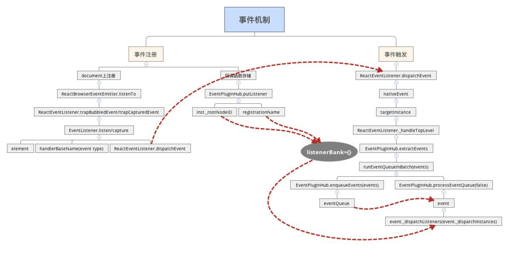

# react面试题

## react常见面试题总结

### 组件之间如何通讯

父子组件通讯：props

子向父传递数据: 父组件传递一个方法给子组件，子组件调用，并传递参数

Redux和Context

ref拿到组件实例

### JSX的本质

createElement

执行返回一个vnode

### Context是生命

父组件向所有子组件派发信息

### shouComponentUpdate用途

性能优化
需要配合不可变值一起使用

### 描述Redux单向数据流


### setState更新机制场景题

```javascript
componentDidMount() {
    console.log('count', this.state.count)  //0
    this.setState({
        count: this.state.count + 1
    })
    console.log('count', this.state.count)  //0
    this.setState({
        count: this.state.count + 1
    })
    console.log('count', this.state.count)  //0
    setTimeout(() => {
        console.log('count', this.state.count)  //1
        this.setState({
            count: this.state.count + 1
        })
        console.log('count', this.state.count)  //2
        this.setState({
            count: this.state.count + 1
        })
        console.log('count', this.state.count)  //3
    })
    setTimeout(() => {
        console.log('count', this.state.count)  //3
        this.setState({
            count: this.state.count + 1
        })
        console.log('count', this.state.count)  //4
    })
}
```

### 什么是纯函数

返回一个新值，没有副作用，不会修改值，只会返回一个新的值(不可变值)

### React组件生命周期

单组件生命周期

父子组件的生命周期

### React发送ajax请求放在哪个生命周期

componentDidMount

### 渲染列表为什么使用key

diff算法需要key值和tag来判断，是否是sameNode(相同的节点)，减少比对的次数。

### 函数组件和class组件的区别

纯函数，输入props，输出JSX
没有实例，没有生命周期，没有state

### 受控组件和非受控组件

受控组件：表单的值(value和checked)，受state的控制，需要自行监听onChange事件，更新state

非受控组件：获取组件的value需要使用ref，定义初始数据需要使用defaultValue或defaultChcked

### 如何使用异步组件

使用React.lazy和React.Suspense，异步组件没加载出来之前，会先显示Suspense上面fallback的内容

### 多个组件公共逻辑，怎么抽离

高阶组件HOC
render props

### redux如何进行异步请求

使用异步action，如redux-thunk或者redux-saga

在异步请求有结果的时候，在dispatch(action)

### React-Router如何配置懒加载

```javascript
import React from 'react'
import { BrowserRouter as Router, Route, Switch } from 'react-router-dom'
import Home from './Home'
import NotFound from './NotFound'
const User = React.lazy(() => import('./User'));
class App extends React.Component {
  render() {
    return (
        <Router>
          <React.Suspense fallback={<div>loading...</div>}>
            <Switch>
              <Route exact path="/">
                <Home />
              </Route>
              {/* 异步加载，动态传参 */}
              <Route path="/user/:id" component={User} />
              <Route path="*">
                <NotFound />
              </Route>
            </Switch>
          </React.Suspense>
        </Router>
    )
  }
}
```

### PureComponent作用

实现了浅比较的shouldComponentUpdate，可以优化性能，必须配合不可变值使用。

```javascript
class App extends React.PureComponent {
  state = {
    list: [0]
  }
// 添加时不会触发更新，因为state中list的引用地址没变
  //正确的使用方式是，永远不去直接修改state的值，使用一个新的数组
  handleClick = () => {
      //错误的形式，违反了state不可变值的原则
    this.state.list.push(this.state.list.length)
    this.setState({
      //错误的形式，违反了state不可变值的原则
      list: this.state.list
      //正确的形式
      //list: [...this.state.list, this.state.list.length]
    })
  }
  render() {
    return (
        <div>
          <button onClick={this.handleClick}>添加</button>
          {
            this.state.list.map((item) => {
              return <div key={item}>{item}</div>
            })
          }
        </div>
    )
  }
}
```

### react的事件机制

react的事件都挂载在document上，通过冒泡的形式，确定点击的节点。事件处理函数的event参数不是原生的，是SyntheticEvent合成事件对象。

dispatchEvent



### React性能优化

state使用不可变值
渲染列表使用key
自定义事件、Dom事件及时销毁
合理使用异步组件
减少函数bind(this)次数，将bind(this)放在constructor里面
合理使用shouleComponentUpdate、PureComponent和React.memo
合理使用Immutable.js

### react和vue的区别

相同点

- 都支持组件化
- 都是数据驱动视图
- 都是用虚拟DOM操作DOM

区别

- React使用JSX拥抱JS，而Vue使用字符串模板拥抱HTML
- React是函数式编程，Vue是声明式操作
- React更灵活，需要自己封装或者引用第三方库，Vue则是在官方生态里面都已经封装好了
