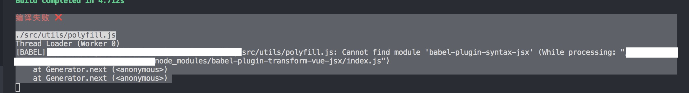
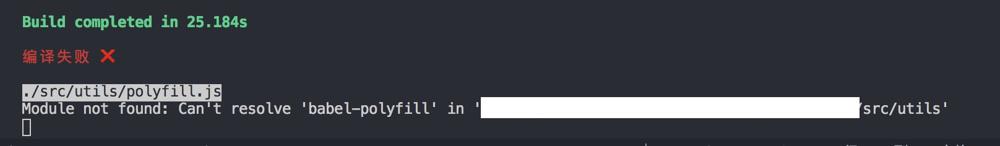
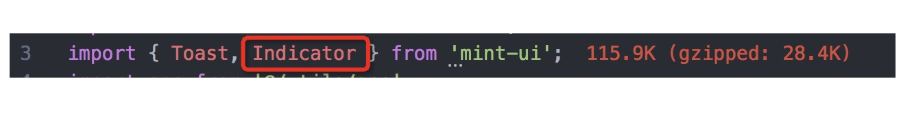

# Babel6升级到Babel7

## Babel升级工具

## 1. 直接使用Babel升级工具

```Javascript
npm install babel-upgrade --save-dev
npx babel-upgrade --write

# 或是安裝 babel-upgrade 在 global 並執行
npm install babel-upgrade -g
babel-upgrade --write
```

可以看到 package.json 中移除了旧版本的依赖，自动新增了新版名称，.babelrc 文件的配置也会自动修改 但是不会删除已有的插件，如原来的 transform-decorators-legacy

// 移除就版本依赖后重新安装依赖

```Javascript
rm -rf node_modules
yarn install
```

## 2. 执行这个命令之后就可以看到报错 Cannot find module babel-plugin-syntax-jsx



```Javascript
编译失败 ❌

./src/utils/polyfill.js
Thread Loader (Worker 0)
[BABEL] /Users/pengyouwei/Desktop/intensive-reading/src/utils/polyfill.js: Cannot find module 'babel-plugin-syntax-jsx' (While processing: "/Users/pengyouwei/Desktop/intensive-reading/node_modules/babel-plugin-transform-vue-jsx/index.js")
    at Generator.next (<anonymous>)
    at Generator.next (<anonymous>)
```

原因是在babel-plugin-transform-vue-jsx中使用的包是babel-plugin-syntax-jsx，而babel-upgrade将这个包升级成了@babel/plugin-syntax-jsx


解决方案

```Javascript
yarn remove @babel/plugin-syntax-jsx
yarn add -D babel-plugin-syntax-jsx
```

## 3. 重新启动项目，报错Can't resolve 'babel-polyfill'



```Javascript
编译失败 ❌

./src/utils/polyfill.js
Module not found: Can't resolve 'babel-polyfill' in '/Users/pengyouwei/Desktop/intensive-reading/src/utils'
```

原因是babel-polyfill已经升级成了@babel/polyfill，需要在项目将项目中的引入换成@babel/polyfill

## 4. yarn start启动项目之后，编辑器没有任何问题，可以正常访问，这个时候打开教室端H5页面

本来以为没有问题，打开之后发现我的页面怎么蓝屏了😓


打开控制台，没有任何报错，打开终端，也没有编译报错，看了一下Network，没有一个ajax请求。通过console.log缩小范围，发现代码走到了Indicator.open()方法就不往下走了，通过debugger发现，应该是mintui内部报错了，通过try catch捕获了错误，没有错误堆栈，但是代码不往下执行。




原因是H5项目中使用了babel-plugin-component插件对MintUi按需加载，但是又在下面引入了@babel/plugin-transform-modules-commonjs插件。


按需加载依赖的是ES Module中import的静态导入，而@babel/plugin-transform-modules-commonjs会将import 转换成require，导致按需加载失败。

先将@babel/plugin-transform-modules-commonjs插件注释，然后重新编译。


打开页面，页面正常显示，没有任何问题。


本来以为这样事情就解决了，但是重新编译编辑器端之后发现，编译报错。


原因是ES Module没有经过转换，而在ES Module的规范在export default是必须写的，如果不写需要使用 import * as name from 'name'，这种方式导入。改项目中的代码明显不现实，所以只能把@babel/plugin-transform-modules-commonjs插件加入进来。

但是启动H5的项目之后又会不能显示。最后的解决方案是：将之前的babel-plugin-transform-es2015-modules-commonjs插件也添加进去，这个插件是可以和babel-plugin-component一起使用的，而@babel/plugin-transform-modules-commonjs会和babel-plugin-component冲突。

重新编译之后，项目可以正常启动

## 5. 使用babel-upgrade升级的babel版本，默认都是7.0版本，不是最新的版本，所以还需要将这些包手动升级到最新版本


```Javascript
yarn add --dev @babel/cli @babel/core @babel/plugin-proposal-class-properties @babel/plugin-proposal-json-strings @babel/plugin-syntax-dynamic-import @babel/plugin-syntax-import-meta @babel/plugin-transform-for-of @babel/plugin-transform-modules-commonjs @babel/plugin-transform-runtime @babel/preset-env @babel/register

yarn add @babel/polyfill

yarn remove babel-core
```

## 6. 增加了一个新的项目包@ipalfish/cls-base-components，启动之后报错


打开这个npm包内部，发现没有依赖这个包，这个包也没有Babel配置


在Babel7中Babel配置文件的找寻规则和Babel6不同:

- 【全局配置】全局配置 babel.config.js 里的配置默认对整个项目生效，包括node_modules。除非通过 exclude 配置进行剔除。

- 【全局配置】全局配置中如果没有配置 babelrcRoots 字段，那么babel 默认情况下不会加载任何子package中的相对配置(如.babelrc文件)。除非在全局配置中通过 babelrcRoots 字段进行配置。

- 【全局配置】babel 全局配置文件所在的位置就决定了你的项目根目录在哪里，默认就是执行babel的当前工作目录，例如上面的例子，你在根目录执行babel，babel才能找到babel.config.js，从而确定该monorepo的根目录，进而将配置对整个项目生效

- 【相对配置】相对配置可被加载的前提是在 babel.config.js 中配置了 babelrcRoots. 如 babelrcRoots: ['.', './frontend']，这表示要对当前根目录和frontend这个子package开启 .babelrc 的加载。（注意: 项目根目录除了可以拥有一个 babel.config.js，同时也可以拥有一个 .babelrc 相对配置）

- 【相对配置】相对配置加载的边界是当前package的最顶层。假设上文案例中要编译 frontend/src/index.js 那么，该文件编译时可以加载 frontend 下的 .babelrc 配置，但无法向上检索总项目根目录下的 .babelrc

总结来说就是:

- babel.config.js 是对整个项目(父子package) 都生效的配置，但要注意babel的执行工作目录。

- .babelrc 是对待编译文件生效的配置，子package若想加载.babelrc是需要babel配置babelrcRoots才可以（父package自身的babelrc是默认可用的）--- 这在babel6不是这样的。

- 任何package中的babelrc寻找策略是: 只会向上寻找到本包的 package.json 那一级。

- node_modules下面的模块一般都是编译好的，请剔除掉对他们的编译。如有需要，可以把个例加到 babelrcRoots 中。

最终解决方案就是，将.babelrc文件换成babel.config.js文件。
