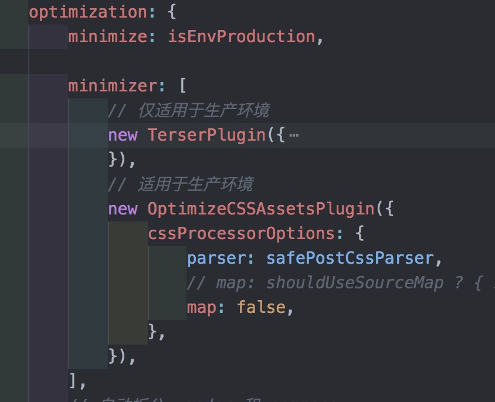
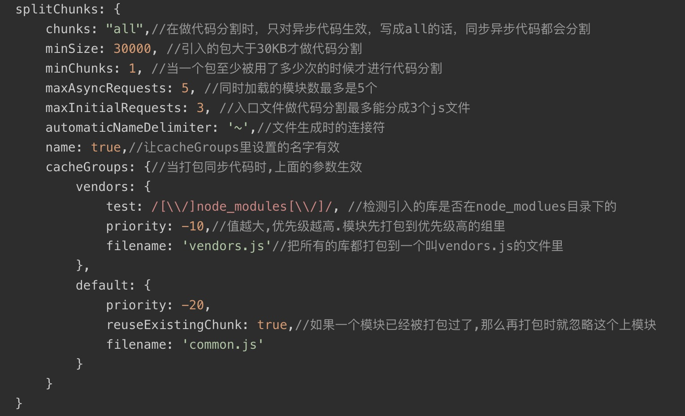

# webpack构建优化

## production自带优化

webpack的配置中model设置为production，就会自带的优化

### tree shaking

如果是使用ES6 esmodule打包的js文件，会在打包的时候判断项目是否被引用，如果没有被引用的代码，会在打包的时候移除

### scope hoisting

变量作用域分析，在constant.js 声明export const a = 10; export const b = 20。在其他模块中import { a, b } from constant; 然后console.log(a + b)。
在打包的时候，webpack会自动分析变量的作用域。然后直接打包成一个模块console.log(30)。

## DllPlugin动态链路库

第三方模块比如react，vue，phaser是不会进行修改的，可以借助Dllplugin插件实现将这些框架作为一个个的动态链接库，只构建一次，以后每次构建都只打包业务代码。

需要使用的两个plugin:

- webpack.DllPlugin抽离动态链接库
- webpack.DllReferencePlugin关联动态链接库

将抽离的动态链接库插入到html中 addassethtmlwebpackplugin

```Javascript
new addassethtmlwebpackplugin({ filename: path.resolve(__dirname, '../dist/vue_dll.js') })
```

## css优化

### mini-css-extract-plugin 将css文件提取出来，style-loader会将css样式放在头部style标签里面

mini-css-extract-plugin将css提取为独立文件,优势：

- 异步加载
- 不重复编译，性能更好
- 更容易使用
- 只针对css

使用方法:

- new miniCssExtractPlugin({ filename: [name].css })
- 将style loader替换成miniCssExtractPlugin.loader

### css压缩，webpack默认只会对css压缩

optimize-css-assets-webpack-plugin
不是在plugins这个节点使用，而是在optimize下面的minimizer这个节点使用



### css自动添加前缀

- post-css
- autoprefixer

### css tree shaking

PurifyCSS 对 CSS Tree Shaking 操作

glob-all 帮助 PurifyCSS 进行路径处理，定位要做 Tree Shaking 的路径文件

## js优化

### code splitting 代码切割

三种常用的代码分离方法：

- 根据webpack的entry特性，配置多entry
- split chunk代码分割
- 懒加载，动态导入，依赖新的api import()

配置多入口，多起点。

#### 手动分离配置多个entry入口文件

每次打包的时候只使用特定的entry。会导致两个entry引用同一个模块。比如两个入口文件都使用了jquery，会导致打包之后的两个bunld都有jquery。

#### 抽离公共模块，防止重复

##### split chunk (webpack4内置的插件)，抽离多个chunk中共同引入的公共模块，并且将公共模块合并成一个模块

对比commonchunkplugin的优点：

> - 不会下载不需要的代码
> - 对异步chunks也很高效
> - 被默认用于异步chunks
> - 可以通过多个vendor chunks来进行vender的分割  
> - 使用简单  
> - 不依赖块图  
> - 基本上是自动的

使用方法，配置如图：



##### commonchunkplugin (webpack4不建议使用，已经被移除了)

commonchunkplugin的缺点：

- 需要指定公共模块的名称
- 它可能导致下载更多的超过我们使用的代码
- 它在异步chunks中是低效的。
- 配置繁琐，很难使用
- 难以被理解

##### commonchunkplugin和SplitChunksPlugin的区别

> 1. 简单来说commonchunkplugin就是创建一个所有模块中都共同存在的模块，然后作为所有chunk的父模块，在模块加载之前把这个父模块引入。
> 2. commonchunkplugin有一个问题，多个模块都使用jquery，但是其中一个模块没有使用的时候，在加载这个模块的时候，也会把jquery引入进来。
> 3. commonchunkplugin无法识别通过import()引入的动态语法，所以如果是异步的chunk，会重新打包一份已经抽离的模块。
> 4. splitChunksPlugin是使用了模块重复计数和模块类别，通过 heuristics 自动识别应该被分块的模块，并分割 chunks。

#### 懒加载，动态导入

> webpack4允许使用import()实现动态导入, import('jquery').then()
需要使用插件@babel/plugin-syntax-dynamic-import  
> import返回的是一个promise对象，所以浏览器必须支持promise，或者使用promise-polyfill

##### polyfill动态注入

polyfill的原理是使用JavaScript来实现浏览器不支持的API，很多浏览器其实已经支持了ES新特性，比如promise，polyfill，在这些浏览器中已经支持的api无需注入到浏览器中。  
通过分析请求头信息中的 UserAgent信息，可以实现自动加载浏览器所需的 polyfill  

### noParse

Jquery或者bootstrap等，内部不需要依赖其他的模块，所以可以配置noParse，来确定不需要依赖关系的模块
在module中配置

```Javascript
noParse: /phaser/
```

### IgnorePlugin

忽略所有插件中的语言包，第三方模块，比如moment，element，中的国际化语言包，可以减少项目中的70%大小。使项目从1.9MB到300kb

```Javascript
new webpack.IgnorePlugin(/^\.\/locale$/)
```

## resolve 优化路径解析

### extensions 文件解析 使用require或import引入文件时可以省略后缀

```Javascript
resolve: {
    extensions: ['.js','.css','.vue']
}
```

在引入文件时，优先寻找的的文件。如果项目中的vue文件比较多，可以把'.vue'调整到前面，可以减少文件解析的时间。

```Javascript
resolve: {
    extensions: ['.vue', '.js','.css']
}
```

### alias 别名 简化引用路径

```Javascript
resolve: {
    extensions: ['.vue', '.js','.css'],
    alias: {
        phaser: path.join(__dirname, '../node_modules/phaser/dist/phaser.js')    //import 'phaser'会找对应的路径
    }
}
```

### modules 第三方包搜索目录

webpack的模块路径查找策略是先在本地的node_modules里面的模块，然后查找上一层目录的node_modules里面的模块，一直查询到全局的模块

```Javascript
resolve: {
    extensions: ['.vue', '.js', '.css'],
    modules: [path.resolve(__dirname, node_modules), myModules]    //myModules为自己写的插件或者模块的目录，如果在node_modules中找不到，就会在myModules里面寻找
},
```

如果不指定本目录的node_modules或不写这个字段，会查找全局的模块。使用resolve.modules可以指定模块查找的目录，减少额外的查询时间。

### webpack.ProvidePlugin 注入全局变量

```Javascript
plugins: [
    new webpack.ProvidePlugin({
        Phaser: 'phaser',
        React: 'react'
    })
]

//可以在任意代码中

new Phaser();
```

```Javascript
new webpack.ProvidePlugin({
  Vue: ['vue/dist/vue.esm.js', 'default']
});
```

### expose-loade 挂载在window上暴露给外界使用变量

```Javascript
{
    test: /phaser/,
    use: {
        loader: 'expose-loader', //expose-loader暴露$
        options: {
            Phaser: 'phaser'
        }
    },
}
```

### 多个线程打包 happyPack, thread-loader

多个线程进行同时进行打包，以便提高编译打包的速度

> - 58192ms（未引入happypack）  
> - 49745ms（引入happypack eslint-loader）  
> - 46505ms（引入happypack eslint-loader, vue-loader）  
> - 43358ms（引入happypack eslint-loader, vue-loader, babel-loader）  

### cache-loader开启缓存

```Javascript
{

    test: /\.js$/,
    //启用持久化缓存，多进程的模式
    use: ['cache-loader', 'thread-loader', 'babel-loader']
}
```

### source map 模式

通过设置webpack中的devtool可以修改source map的模式，在项目中选择合适的source map模式

|  devtool   | 构建速度  |  重新构建速度   | 生产环境  |  品质(quality)   |
|  ----      | ----  |  ----  | ----  |  ----  | ----  |
| (none)     | +++ | +++ | yes | 打包后的代码 |
| eval       | +++ | +++ | no | 生成后的代码 |
| cheap-eval-source-map  | + | ++ | no | 转换过的代码（仅限行） |
| cheap-module-eval-source-map  | o | ++ | no | 原始源代码（仅限行） |
| eval-source-map               | -- | + | no | 原始源代码 |
| cheap-source-map              | + | o | yes | 转换过的代码（仅限行） |
| cheap-module-source-map       | o | - | yes | 原始源代码（仅限行） |
| inline-cheap-source-map       | + | o | no | 转换过的代码（仅限行） |
| inline-cheap-module-source-map  | o | - | no | 原始源代码（仅限行） |
| source-map                    | -- | -- | yes   | 原始源代码 |
| inline-source-map             | -- | --  | no | 原始源代码 |
| hidden-source-map             | -- | --  | yes | 原始源代码 |
| nosources-source-map          | -- | -- | yes | 原始源代码 |
